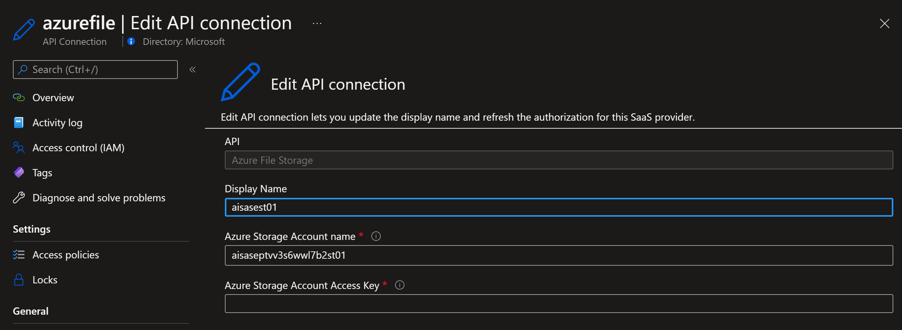
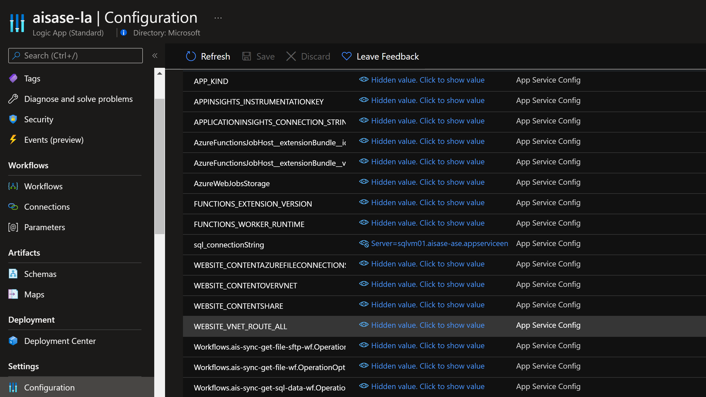
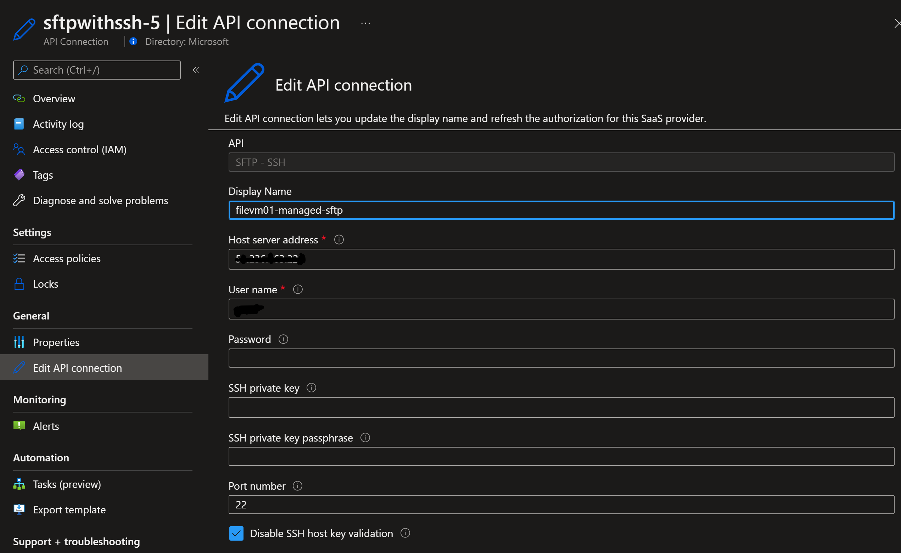
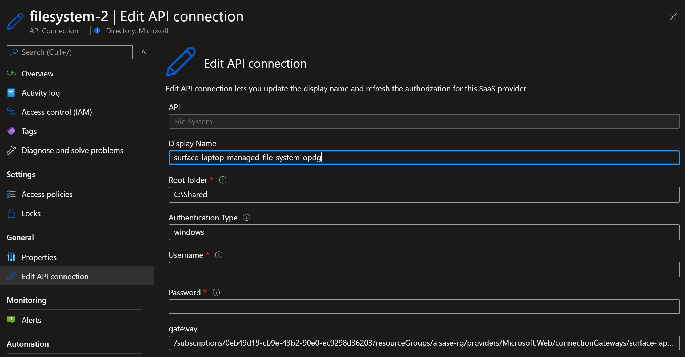
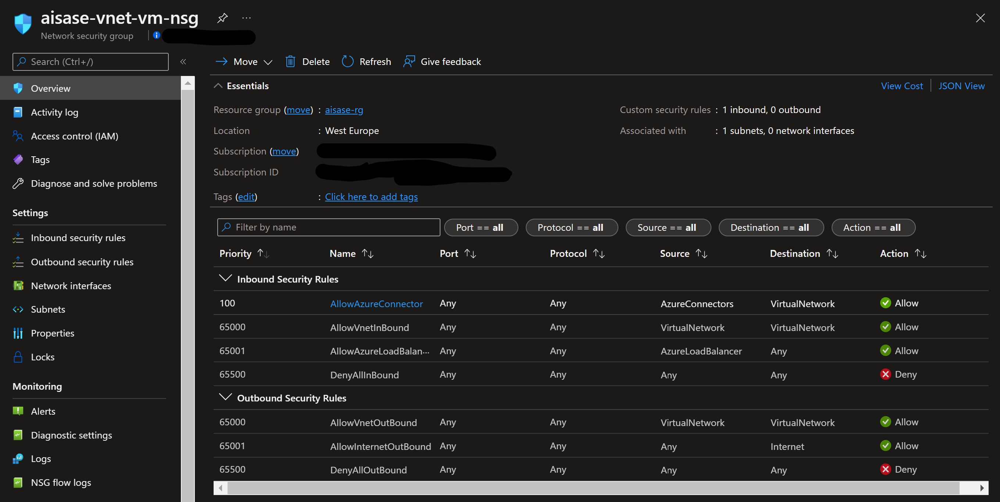

# ais-la-std-vnet-samples
Sample workflows for exploring SFTP, File System, SQL, Azure File Storage

## Logic Apps Workflows
There a 5 Logic Apps workflows in here:

1. ais-sync-get-wf
Request and response workflow, very basic, nothing fancy.

2. ais-sync-get-file-wf
Request and response workflow, leveraging Azure File Storage Managed Connector to get the content of a file and returning that into the response. Azure File Storage supports SMB and NFS shares on servers, so you could embed that into an on-premise scenario.

Connector settings:

3. ais-sync-get-sql-data-wf
Request and response workflow, leveraging SQL Server Built-in Connector to retrieve data from a a on-premise SQL (VNET connected) and returning that into the response. In my case SQL is running in a Ubuntu VM runnning SQL in a container.

Connector settings:

4. ais-sync-get-file-sftp-wf
Request and response workflow, leveraging SFTP/SSH Managed Connector to retrieve the content of a file and returning that into the response. The SFTP server is running in a vm (VNET connected).

5. ais-sync-get-file-opdg-wf
Request and response workflow, leveraging file system Managed Connector connected to a On-premise Data Gateway to connect to a local folder on a server. The credentials used in this connection (see below) must have access to the file locations. The Data Gateway is running under a service account on the server.

## Network Security Group settings

Both VM's (for SQL and SFTP) are running in a seperate subnet. In order for the Managed Connector to establish a connection in the Designer and the runtime, AzureConnectors must be enabled via an inbound rule.

